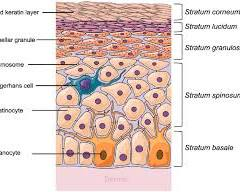

# vhp
Virtual Human Project

The major organs in the human body are:

- Organs
  - Brain: The brain is the control center of the nervous system and is responsible for everything we do, from thinking and feeling to moving and breathing. 
    
    Read more on: [brain](doc/brain.md)

    

  - Heart: The heart is a muscular organ that pumps blood throughout the body. It is the most important organ in the circulatory system.
    
    Read more on: [heart](doc/heart.md)
  
    
   
  - Intestines: The intestines are long, tube-shaped organs that absorb nutrients from food into the bloodstream.

    Read more on: [intestines](doc/intestines.md)

    

  - Kidneys: The kidneys are two bean-shaped organs that filter waste products from the blood and produce urine.

    Read more on: [kidneys](doc/kidneys.md)

    
  
  - Liver: The liver is the largest organ in the body and is responsible for many important functions, including filtering blood, storing nutrients, and producing bile.

    Read more on: [liver](doc/liver.md)
   
    
  
  - Lungs: The lungs are two spongy organs that allow us to breathe. They take in oxygen from the air and release carbon dioxide. 
   
    Read more on: [lungs](doc/lungs.md)
  
    
  
  - Pancreas: The pancreas is a gland that produces digestive enzymes and hormones, including insulin.

    Read more on: [pancreas](doc/pancreas.md)
  
    

  - Skin: The skin is the largest organ of your body, accounting for about 15% of your total body weight.

    Read more on: [skin](doc/skin.md)

    
  
  - Stomach: The stomach is a muscular sac that breaks down food into a liquid mixture called chyme. 

    Read more on: [stomach](doc/stomach.md)
  
    

- Glands
  - Adrenal Glands: Situated on top of the kidneys, the adrenal glands produce hormones like adrenaline and cortisol, which help manage stress, regulate blood sugar levels, and control blood pressure.

    Read more on: [adrenal](doc/adrenal.md)

     

  - Parathyroid Glands: These four tiny glands sit behind the thyroid gland and produce parathyroid hormone, which helps regulate calcium levels in the blood.

    Read more on: [parathyroid](doc/parathyroid.md)

    

  - Pineal Gland: Considered the smallest organ in the human body, the pineal gland sits deep within the brain and produces melatonin, a hormone that helps regulate sleep-wake cycles.

    Read more on: [pineal](doc/pineal.md)
  
    

  - Pituitary Gland: Often referred to as the "master gland," the pea-sized pituitary gland located at the base of the brain produces several hormones that control many other glands and their hormone production.
    
    Read more on: [pituitary](doc/pituitary.md)
    
    
  
  - Thymus Gland: Found in the chest cavity behind the breastbone, the thymus gland plays a vital role in the development of the immune system during childhood. It shrinks with age.

    Read more on: [thymus](doc/thymus.md)
    
      
 
- Thyroid Gland: Located in the front of the neck, the thyroid gland is shaped like a butterfly and produces hormones that regulate metabolism, growth, and development. 

    Read more on: [thyroid](doc/thyroid.md)
  
    