# vhp
Virtual Human Project

The major organs in the human body are:

- Organs
  - Brain: The brain is the control center of the nervous system and is responsible for everything we do, from thinking and feeling to moving and breathing. 
It is the control center of the nervous system and receives information from the body through the senses. The brain then processes this information and sends messages back to the body telling it what to do.
The brain is made up of billions of nerve cells, or neurons, that are connected to each other by trillions of synapses. These connections allow the brain to transmit information throughout the body at very high speeds.  The brain can be divided into three main parts:

    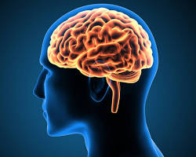

    - Forebrain: The forebrain is the largest part of the brain and is responsible for higher functions such as thinking, planning, and problem-solving. It also includes the cerebral cortex, which is the outermost layer of the brain and is responsible for consciousness, memory, and sensory perception. 

      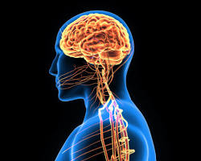
    - Midbrain: The midbrain is a small region of the brain that connects the forebrain to the hindbrain. It is responsible for relaying sensory and motor information, as well as for controlling basic functions such as sleep and wakefulness.  
      
      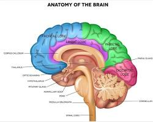
    - Hindbrain: The hindbrain is the most posterior part of the brain and is responsible for basic bodily functions such as breathing, heart rate, and digestion. It also includes the cerebellum, which is responsible for coordination and balance.  
    
      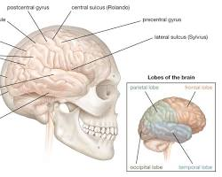

    The brain is a very complex organ and we are still learning more about it all the time. Here are some interesting facts about the brain:

    - The brain weighs about 3 pounds.
    - The brain uses about 20% of the body's energy.
    - The brain is constantly generating electricity.
    - The brain never stops learning, even as we age.
  - Heart: The heart is a muscular organ that pumps blood throughout the body. It is the most important organ in the circulatory system. 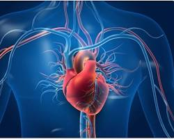
  - Lungs: The lungs are two spongy organs that allow us to breathe. They take in oxygen from the air and release carbon dioxide. 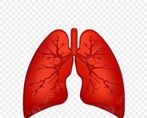
  - Liver: The liver is the largest organ in the body and is responsible for many important functions, including filtering blood, storing nutrients, and producing bile. 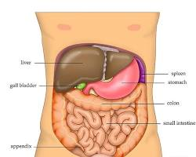
  - Kidneys: The kidneys are two bean-shaped organs that filter waste products from the blood and produce urine. 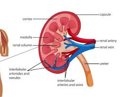
  - Stomach: The stomach is a muscular sac that breaks down food into a liquid mixture called chyme. 
  - Intestines: The intestines are long, tube-shaped organs that absorb nutrients from food into the bloodstream. 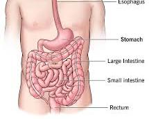
  - Pancreas: The pancreas is a gland that produces digestive enzymes and hormones, including insulin. 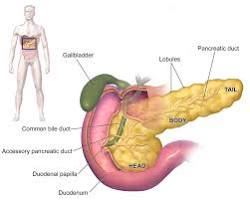are just a few of the many organs in the human body. Each organ has a specific function, and all of the organs work together to keep us alive and healthy.
- Glands
  - Thyroid Gland: Located in the front of the neck, the thyroid gland is shaped like a butterfly and produces hormones that regulate metabolism, growth, and development. 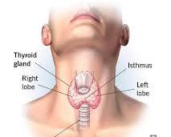 
  - Parathyroid Glands: These four tiny glands sit behind the thyroid gland and produce parathyroid hormone, which helps regulate calcium levels in the blood. 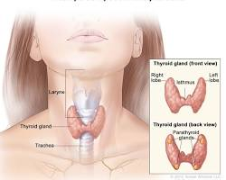 
  - Adrenal Glands: Situated on top of the kidneys, the adrenal glands produce hormones like adrenaline and cortisol, which help manage stress, regulate blood sugar levels, and control blood pressure. 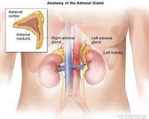 pituitary
  - Pituitary Gland: Often referred to as the "master gland," the pea-sized pituitary gland located at the base of the brain produces several hormones that control many other glands and their hormone production. 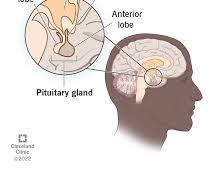 thymus
  - Thymus Gland: Found in the chest cavity behind the breastbone, the thymus gland plays a vital role in the development of the immune system during childhood. It shrinks with age.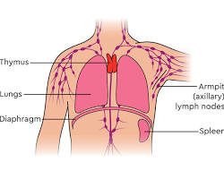 pineal
  - Pineal Gland: Considered the smallest organ in the human body, the pineal gland sits deep within the brain and produces melatonin, a hormone that helps regulate sleep-wake cycles. 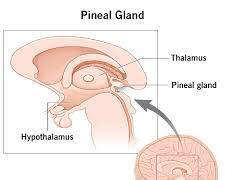