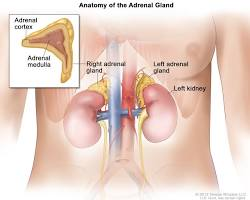

# Adrenal gland

The adrenal glands, also sometimes referred to as suprarenal glands, are two small glands perched on top of your kidneys. Despite their unassuming size, they pack a powerful punch, producing a variety of hormones that influence numerous bodily functions. Here's a breakdown of the adrenal glands, their key hormones, and their functions:

# Structure

Each adrenal gland has a distinct structure with two main regions:

- **Adrenal Cortex (Outer layer)**: This region is responsible for producing steroid hormones, including cortisol, aldosterone, and sex hormones. The adrenal cortex can be further divided into three zones that produce different hormones.
- **Adrenal Medulla (Inner layer)**: This region produces catecholamine hormones, such as adrenaline (epinephrine) and noradrenaline (norepinephrine).

# Hormones

The adrenal glands produce several hormones, each with specific functions:

- **Cortisol**: Often referred to as the "stress hormone," cortisol helps regulate metabolism, blood sugar levels, and inflammation. It also plays a role in immune function and blood pressure control.
- **Aldosterone**: This hormone helps regulate blood pressure and fluid balance by influencing sodium and potassium levels in the body.
- **Sex hormones**: The adrenal cortex produces small amounts of sex hormones, including androgens (such as testosterone) and estrogens, in both males and females.
- **Adrenaline (epinephrine) and Noradrenaline (norepinephrine)**: These catecholamine hormones are part of the fight-or-flight response, preparing the body to deal with stressful situations. They increase heart rate, breathing, and blood sugar levels, providing a surge of energy.

# Functions

The hormones produced by the adrenal glands play a critical role in various bodily functions:

- **Stress response**: Adrenaline and cortisol are key players in the body's stress response, mobilizing the body to handle threats or challenges.
- **Metabolism**: Cortisol helps regulate carbohydrate, fat, and protein metabolism.
- **Blood pressure and electrolyte balance**: Aldosterone helps maintain blood pressure and electrolyte balance.
- **Immune function**: Cortisol plays a role in regulating the immune system.
- **Sexual development and function**: Sex hormones produced by the adrenal cortex contribute to sexual development and function, although their role is less significant compared to the sex hormones produced by the gonads (ovaries and testes).

# Conditions

Several conditions can affect the adrenal glands:

- **Adrenal insufficiency (Addison's disease)**: This occurs when the adrenal glands don't produce enough hormones.
- **Cushing's syndrome**: This condition develops when the body is exposed to chronically high levels of cortisol.
- **Pheochromocytoma**: This is a rare tumor of the adrenal gland that can cause excessive production of catecholamines.

# Importance of Healthy Adrenal Glands

Healthy adrenal glands are essential for maintaining overall well-being. If you experience symptoms that might suggest a problem with your adrenal glands, consult your doctor for proper diagnosis and treatment.

Here are some general tips for promoting overall health, which can indirectly support adrenal function:

- **Manage stress**: Chronic stress can lead to elevated cortisol levels. Practice relaxation techniques like yoga or meditation to manage stress effectively.
- **Maintain a balanced diet**: Eat a healthy diet rich in fruits, vegetables, and whole grains to provide your body with the nutrients it needs to function optimally.
- **Maintain a healthy weight**: Obesity can contribute to stress on the adrenal glands.
- **Limit alcohol and caffeine**: Excessive alcohol and caffeine intake can disrupt hormone production and function.
- **Get regular checkups**: Regular checkups with your doctor can help monitor your health and detect any potential adrenal problems early on.
