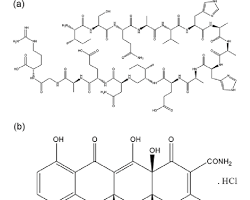

# Albumin

## Albumin: The Workhorse of Blood Plasma
Albumin is the most abundant protein found in blood plasma, accounting for roughly half of its total protein content. It's a vital molecule with several key functions in the body. Let's delve into its world:

## Structure

- Albumin is a globular protein, meaning it has a complex three-dimensional structure.
- Imagine a slightly flattened sphere with folds and pockets.

  

- This structure allows it to bind to various molecules and transport them throughout the bloodstream.

## Functions

- Transport: Albumin acts like a molecular taxi, carrying a wide range of substances:
  - Fatty acids: Needed for energy production.
  - Hormones: Chemical messengers like thyroid hormones and steroids.
  - Bilirubin: A waste product from the breakdown of red blood cells. Drugs: Many medications travel bound to albumin.
- Maintaining Blood Pressure: Albumin plays a crucial role in keeping fluids balanced between your blood vessels and tissues.
  - It attracts and holds onto water molecules within the bloodstream. This creates a pressure called oncotic pressure that helps prevent fluid from leaking out of the vessels and causing swelling (edema).
- Antioxidant Activity: Albumin can bind to and neutralize free radicals, which are harmful molecules that damage cells.

- ## Importance

- Albumin levels are routinely checked in blood tests. Low albumin levels (hypoalbuminemia) can indicate various health problems like malnutrition, liver disease, or kidney disease.

## In Conclusion

Albumin is a versatile and essential protein in the blood. It ensures the smooth operation of various bodily functions by transporting vital molecules, maintaining fluid balance, and even offering some antioxidant protection.

## Blood pressure
Albumin influences blood pressure through a process called oncotic pressure. Here's a breakdown:

- Protein Power: Albumin, being the most abundant protein in blood plasma, plays a key role in attracting and holding onto water molecules.
- The Tug-of-War: Imagine a tug-of-war between the blood vessels and surrounding tissues. Water naturally wants to move from areas of low concentration (bloodstream) to areas of high concentration (tissues).
- Albumin's Grip: Albumin's ability to bind water creates an opposing force within the bloodstream. This force is called oncotic pressure.
- The Balance Act: Oncotic pressure acts like a dam, preventing excessive fluid from leaking out of the blood vessels into the tissues. This helps maintain the proper volume of blood within the vessels.
- Blood Pressure Regulation: When blood volume is maintained, blood pressure stays within a healthy range. If albumin levels drop, oncotic pressure weakens, and more fluid leaks out, leading to decreased blood volume and potentially lower blood pressure.

Here's an analogy

Imagine your blood vessels as a garden hose and the tissues as the surrounding soil. Water (fluid) naturally wants to flow out of the hose (bloodstream) into the soil (tissues). But if you place a sponge (albumin) inside the hose, it soaks up some of the water, preventing it from flowing out too quickly. This maintains pressure within the hose (blood pressure).

Additional Points

- This is a simplified explanation, and other factors also contribute to blood pressure regulation.
- While low albumin can contribute to lower blood pressure, it's not the sole cause.
- Conversely, some studies suggest very high albumin levels might be associated with slightly elevated blood pressure, but more research is needed in this area.

[See also](https://en.wikipedia.org/wiki/Oncotic_pressure "Oncotic pressure")
