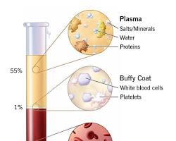
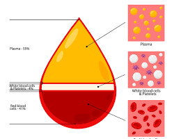
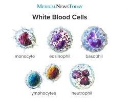

# Blood

Blood is a vital tissue that circulates throughout your body, delivering oxygen, nutrients, and hormones to your cells and tissues while carrying away waste products. It's a complex mixture of several components, each playing a crucial role:

## Components of Blood

- **Plasma**: This is the liquid portion of blood, making up about 55% of its volume. It's a straw-colored fluid composed mostly of water (around 92%) and containing dissolved proteins, hormones, electrolytes, and nutrients like glucose (sugar).
  
  
 
  Read more on [plasma](plasma.md)

  Plasma also contains dissolved substances like:

  - **Proteins**: These include albumins (transporting substances throughout the body), globulins (involved in immune function), and clotting factors (essential for blood clot formation).
  - **Electrolytes**: Minerals like sodium, potassium, calcium, and chloride that help maintain fluid balance, nerve function, and muscle contractions.
  - **Nutrients**: Glucose (sugar) for energy, amino acids for protein building, and lipids (fats) for energy storage.
  - **Waste Products**: Carbon dioxide, a waste product from cellular respiration, and other waste materials transported to the kidneys for elimination.

- **Red Blood Cells (Erythrocytes)**: These are the most abundant cells in blood, making up about 45% of its volume. They are specialized for oxygen transport. Red blood cells are disc-shaped and contain hemoglobin, a protein that binds to oxygen in the lungs and releases it to tissues throughout the body. Hemoglobin is, a protein that binds to oxygen and gives blood its red color.

  ")

- **White Blood Cells (Leukocytes)**: These are much less numerous than red blood cells, constituting only about 1% of blood volume. However, they play a critical role in the immune system, defending the body against infections and diseases. There are several types of white blood cells, each with specific functions.
 
  Read more on [leukocytes](leukocytes.md)

  ")

- **Platelets (Thrombocytes)**: These are tiny cell fragments essential for blood clotting. When a blood vessel is injured, platelets clump together to form a plug and prevent excessive bleeding.

  ")

## Functions of Blood

- **Oxygen Transport**: Red blood cells carry oxygen from the lungs to tissues throughout the body.
- **Nutrient Delivery**: Blood transports nutrients like glucose, amino acids, and fats to cells for energy and growth.
- **Waste Removal**: Blood carries away waste products like carbon dioxide and metabolic byproducts from cells to the lungs, kidneys, and other organs for elimination.
- **Hormone Transport**: Blood carries hormones produced by endocrine glands to target organs where they regulate various bodily functions.
- **Temperature Regulation**: Blood circulation helps regulate body temperature by distributing heat throughout the body.
- **Immune Defense**: White blood cells fight against infections and diseases.
- **Blood Clotting**: Platelets prevent excessive bleeding after an injury.

## Maintaining Healthy Blood:

Healthy blood composition is essential for overall well-being. Here are some tips for maintaining healthy blood:

- **Eat a balanced diet**: Consume plenty of fruits, vegetables, and whole grains to provide your body with the nutrients needed for blood cell production.
- **Stay hydrated**: Drinking sufficient water helps maintain blood volume and circulation.
- **Exercise regularly**: Physical activity promotes healthy blood flow and improves overall cardiovascular health.
- **Maintain a healthy weight**: Excess weight can put strain on the circulatory system.
- **Limit alcohol and tobacco use**: These substances can damage blood cells and blood vessels.
- **Manage stress**: Chronic stress can raise blood pressure and negatively impact blood health.

## Blood Illustrations

Here are some additional illustrations to help you visualize the components of blood:

- **Blood Composition**: A diagram showing the proportions of plasma and blood cells.

  

- **Types of White Blood Cells**: An illustration showcasing the different types of white blood cells and their functions.

  
- 
Maintaining healthy blood is crucial for overall well-being. A balanced diet, regular exercise, and a healthy lifestyle can all contribute to healthy blood composition and function.
