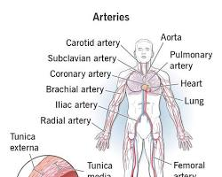
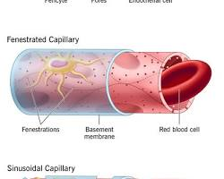
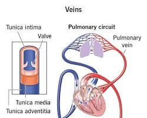

# Blood vessels

The blood vessels are the highways of your circulatory system, forming a closed loop that continuously transports blood throughout your body. They act as a vital network, delivering oxygen, nutrients, and hormones to your tissues and carrying away waste products like carbon dioxide. Here's a closer look at the different blood vessel types and their functions:

## Types of Blood Vessels

The circulatory system comprises three main types of blood vessels:

- **Arteries**: These are thick-walled, muscular vessels that carry oxygen-rich blood away from the heart to various organs and tissues. They can be compared to water pipes carrying clean water away from a pump (the heart) for distribution. Arteries are further classified into:
    - **Aorta**: The largest artery in the body, arising from the left ventricle of the heart.
    - **Elastic arteries**: Large arteries near the heart that can expand and contract to accommodate changes in blood flow.
    - **Muscular arteries**: Distribute blood to organs and further branch into smaller arterioles.
    - **Arterioles**: Even smaller vessels that deliver blood directly to capillaries.
      
    

- **Capillaries**: These are the microscopic vessels with thin, porous walls that allow for the exchange of materials between the blood and tissues. Oxygen, nutrients, and waste products diffuse across the capillary walls. Capillaries are like tiny channels connecting the arterioles and venules, enabling this exchange to occur.

  

- **Veins**: These are thin-walled, less muscular vessels that carry oxygen-depleted blood and waste products away from the tissues back to the heart. Veins can be compared to drainpipes collecting used water and returning it to a central location. Unlike arteries, veins often have valves that prevent backward blood flow. Veins are further classified into:
  - **Venules**: Small veins that collect blood from capillaries.
  - **Veins**: Larger veins that drain blood from specific areas of the body.
  - **Superior vena cava and inferior vena cava**: The two largest veins that return blood to the right atrium of the heart.
  
    

## Functions of Blood Vessels

Blood vessels play a critical role in several bodily functions:

- **Delivery of Oxygen and Nutrients**: Arteries transport oxygen-rich blood from the heart to tissues throughout the body. Nutrients absorbed from the digestive system are also delivered through the bloodstream via arteries.
- **Waste Removal**: Veins carry oxygen-depleted blood and waste products away from tissues back to the heart for elimination through the lungs (carbon dioxide) and kidneys (other waste products).
- **Hormone Transport**: Blood vessels serve as a transportation network for hormones produced by endocrine glands, allowing them to reach their target organs and regulate various bodily functions.
- **Temperature Regulation**: Blood flow plays a role in regulating body temperature. Blood vessels can dilate or constrict to control heat dissipation from the body's surface.
- **Immune System Support**: Blood vessels transport white blood cells, which are essential components of the immune system, throughout the body to fight infections and inflammation.

## Maintaining Healthy Blood Vessels

Healthy blood vessels are crucial for overall well-being. Here are some tips for keeping your blood vessels healthy:

- **Eat a healthy diet**: A balanced diet rich in fruits, vegetables, and whole grains can help lower blood pressure and cholesterol levels, reducing strain on blood vessels.
- **Maintain a healthy weight**: Excess weight can put stress on the circulatory system.
- **Exercise regularly**: Regular physical activity promotes healthy blood flow and improves cardiovascular health.
- **Manage stress**: Chronic stress can contribute to high blood pressure and inflammation, both of which can damage blood vessels.
- **Limit smoking**: Smoking damages blood vessel walls and increases the risk of blood clots.
- **Control blood pressure and cholesterol**: High blood pressure and cholesterol levels can damage blood vessels over time.