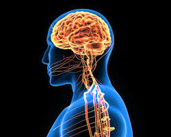
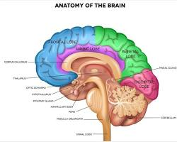
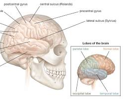

# Brain

The brain is the control center of the nervous system and is responsible for everything we do, from thinking and feeling to moving and breathing.
It is the control center of the nervous system and receives information from the body through the senses. The brain then processes this information and sends messages back to the body telling it what to do.
The brain is made up of billions of nerve cells, or neurons, that are connected to each other by trillions of synapses. These connections allow the brain to transmit information throughout the body at very high speeds.  The brain can be divided into three main parts:

## Forebrain
The forebrain is the largest part of the brain and is responsible for higher functions such as thinking, planning, and problem-solving. It also includes the cerebral cortex, which is the outermost layer of the brain and is responsible for consciousness, memory, and sensory perception. 

  

## Midbrain
The midbrain is a small region of the brain that connects the forebrain to the hindbrain. It is responsible for relaying sensory and motor information, as well as for controlling basic functions such as sleep and wakefulness.  
  
  

## Hindbrain
The hindbrain is the most posterior part of the brain and is responsible for basic bodily functions such as breathing, heart rate, and digestion. It also includes the cerebellum, which is responsible for coordination and balance.  

  

The brain is a very complex organ and we are still learning more about it all the time. Here are some interesting facts about the brain:

- The brain weighs about 3 pounds.
- The brain uses about 20% of the body's energy.
- The brain is constantly generating electricity.
- The brain never stops learning, even as we age.