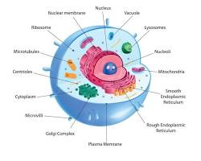
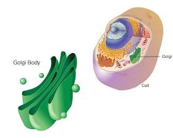
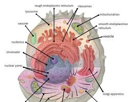
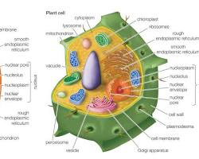
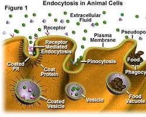
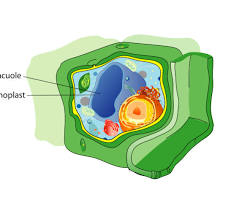
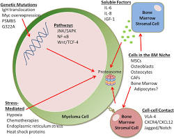

# Cell
The human cell is indeed the smallest living part of a human being.

Here's why a cell is considered the smallest living unit:

- **Structure**: Cells have an organized structure with with organelles that perform specific functions essential for life, such as energy production, waste removal, and protein synthesis. A cell has all the basic structures and functions necessary for life. It has a membrane that controls what enters and leaves the cell, internal structures like organelles that carry out specific functions (like the nucleus for information storage or the mitochondria for energy production), and ribosomes that build proteins.
- **Metabolism**: Cells can take in nutrients, break them down for energy, and eliminate waste products. Cells carry out metabolic processes, which are the chemical reactions necessary to sustain life.
- **Growth and development**: Cells can grow and reproduce to form new cells with the same genetic information, allowing the organism to grow and develop.
- **Response to stimuli**: Cells can respond to changes in their environment, such as the presence of pathogens or variations in temperature.
- **Homeostasis**: Cells play a crucial role in maintaining a stable internal environment within the body (homeostasis).
- **Independent Activities**: A cell can perform all the basic activities required for life on its own, such as obtaining energy, growing, reproducing, and responding to its environment (within limits).
- **Building Blocks**: All living things, from simple organisms like bacteria to complex multicellular organisms like humans, are made up of cells. In humans, trillions of cells work together in a coordinated fashion to form tissues, organs, and organ systems that carry out complex functions necessary for overall life.

While viruses are smaller than cells, they are not considered living organisms on their own. They lack the ability to carry out all the functions necessary for life independently and rely on host cells to reproduce.

While some structures within a cell, like organelles, perform important functions, they are not considered living units on their own. They lack the complete set of characteristics needed for independent life.

The human body is made up of trillions of cells, each with a specific role to play.  These cells come together to form tissues, organs, and ultimately the entire organism.

## The key parts of this human cell

- **Cell membrane**: The outermost layer, regulating what enters and leaves the cell.
- **Cytoplasm**: The jelly-like substance filling the cell and suspending the organelles.
- **Nucleus**: The control center, containing genetic information (DNA) in chromosomes.
- **Nucleolus**: A region within the nucleus responsible for ribosome production.
- **Ribosomes**: Cellular machines that build proteins based on instructions from DNA.
- **Endoplasmic reticulum (ER)**: A network of membranes involved in protein synthesis, lipid production, and detoxification.
- **Golgi apparatus**: Packages and distributes molecules produced by the ER.
- **Mitochondria**: The powerhouse of the cell, generating energy through cellular respiration.
- **Lysosomes**: Sacs containing enzymes that break down waste materials and foreign invaders within the cell.

- This image showcases some essential organelles, but there are many more within a human cell, each with specialized functions. The specific types and numbers of organelles can vary depending on the cell type and its role in the body.

## Organelles

Certainly! Here's a breakdown of some other well-known organelles found in human cells, along with their functions and images:

- **Golgi apparatus**

  
  
  [Golgi aparatus big](images/golgiapparatus_big.jpg "Golgi apparatus big")

  **Function** Often referred to as the "cellular packaging plant," the Golgi apparatus modifies, sorts, and packages proteins and other molecules synthesized by the ER. It then distributes these products within the cell or sends them out for secretion.

- **Cytoskeleton**

  
 
  [Cytoskeleton big](images/cytoskeleton_big.png "Cytoskeleton big")

  **Function** This complex network of protein filaments helps maintain the cell's shape, provides structural support, and plays a role in cell movement, division, and transport of materials within the cell. It's like the cell's internal scaffolding.

- **Centrioles****

  

  [Centrioles big](images/centrioles_big.jpg "Centrioles big") 

  **Function** These structures are located near the nucleus and play a crucial role in cell division by helping organize microtubules that form the mitotic spindle, which separates chromosomes during cell reproduction.

- **Peroxisomes**

  

  [Peroxisomes big](images/peroxisomes_big.jpg "Peroxisomes big")

  **Function** These small organelles contain enzymes that break down various molecules, including fatty acids and reactive oxygen species (free radicals) that can damage cells. They help in detoxification and metabolism processes.

- **Endosomes**

  

  **Function** Endosomes are membrane-bound sacs involved in transporting materials between the cell membrane, the Golgi apparatus, and lysosomes. They act like sorting stations within the cell, directing materials to their proper destinations.

- **Rough Endoplasmic Reticulum (RER)**

  ")

  **Function** A sub-type of the Endoplasmic Reticulum (ER), the RER has ribosomes attached to its outer surface. These ribosomes are responsible for protein synthesis, and the RER helps in protein processing, folding, and modification.

- **Smooth Endoplasmic Reticulum (SER)**

  ")

  **Function** Another sub-type of the ER, the SER lacks ribosomes and is involved in various functions like lipid (fat) synthesis, detoxification processes, and calcium storage within the cell.

- **Vesicles**

  

  **Function** These are small, membrane-bound sacs that transport various materials within the cell or between the cell and its external environment. They bud off from different organelles and act as delivery vehicles for molecules.

- Proteasomes**

  

  **Function** Nicknamed the "cellular shredders," proteasomes are large protein complexes that break down old, damaged, or unnecessary proteins within the cell. This process is essential for maintaining cellular health and regulating protein turnover.

These are just a few examples, and there are many other specialized organelles within human cells, each contributing to specific functions. The exact complement of organelles will vary depending on the cell type and its role in the body.
