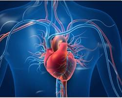

# Heart

The heart is a vital muscular organ that acts as the powerhouse of your circulatory system. It's about the size of your fist and tirelessly pumps blood throughout your body, delivering oxygen and nutrients to your cells and tissues while carrying away waste products. Here's a deeper dive into its structure and function:

## Structure

The heart is divided into four chambers:

- **Atria (Upper Chambers)**: There are two atria, a right atrium and a left atrium. These thin-walled chambers act as receiving chambers, where blood from the body enters the heart through veins.
- **Ventricles (Lower Chambers)**: The ventricles are thicker and more muscular than the atria. The right ventricle pumps blood to the lungs, where it picks up oxygen. The left ventricle, the strongest chamber, pumps oxygen-rich blood throughout the body through arteries.

Valves within the heart ensure blood flows in one direction:

- **Atrioventricular valves (Tricuspid and Mitral valves)**: These valves control the flow of blood between the atria and ventricles.
- **Semilunar valves (Aortic and Pulmonary valves)**: These valves regulate blood flow out of the ventricles to the lungs and body.

The heart is surrounded by a protective sac called the pericardium.

## Function

The heart follows a rhythmic cycle of contraction and relaxation to pump blood:

- **Diastole (Relaxation)**: During diastole, the heart relaxes, and the atria fill with blood returning from the body (right atrium) and lungs (left atrium).
- **Systole (Contraction)**: In systole, the heart contracts, squeezing blood from the atria into the ventricles. The ventricles then contract with greater force, pumping blood out to the lungs (right ventricle) and body (left ventricle).

The heart rate is the number of times the heart beats per minute and is influenced by factors like activity level, emotions, and medications.

## Interesting Facts

- The average heart rate for a healthy adult at rest is between 60 and 100 beats per minute.
- The heart is one of the first organs to develop in the womb, beginning to beat as early as 6 weeks after conception.
- Blood vessels are like a vast network of highways throughout your body, with a total length estimated to be over 60,000 miles if laid out end-to-end.

Taking care of your heart is crucial for your overall health. Here are some tips:

- Maintain a healthy diet.
- Exercise regularly.
- Manage stress.
- Avoid smoking.
- Get regular checkups with your doctor.