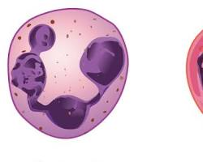
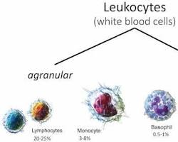
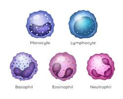
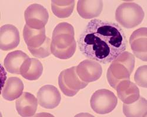
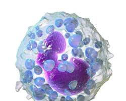

# Leukocytes

Leukocytes, also known as white blood cells, are a vital component of your body's immune system. They act as the body's defense force, constantly patrolling and protecting against infections, diseases, and foreign invaders. Unlike red blood cells, which are all quite similar, leukocytes come in a variety of shapes and sizes, each with a specialized function. Here's a deeper look at leukocytes and their crucial role in keeping you healthy:

## Types of Leukocytes

There are five main types of leukocytes, each with a distinct appearance and function:

- **Neutrophils**: These are the most abundant type of white blood cell, making up about 50-70% of all leukocytes. They are the first responders of the immune system, migrating to sites of infection and engulfing bacteria and other pathogens through a process called phagocytosis.

  

- **Lymphocytes**: These are another major type of white blood cell, accounting for about 20-40% of leukocytes. There are two main subtypes of lymphocytes:

  

- **Monocytes**: These are the largest type of leukocyte. They circulate in the bloodstream and then migrate into tissues, where they mature into macrophages. Macrophages are powerful phagocytes that engulf and destroy debris, dead cells, and pathogens.

  

- **Eosinophils**: These leukocytes are involved in allergic reactions and defense against parasitic infections. They release chemicals that can damage parasites and help regulate inflammatory responses.

  

- **Basophils**: These are the least common type of leukocyte, making up less than 1% of all leukocytes. They are involved in allergic reactions and inflammation by releasing histamine, a chemical that causes blood vessel dilation and increased permeability.

  

## Functions of Leukocytes

Leukocytes play a critical role in various immune system functions:

- **Phagocytosis**: Neutrophils and macrophages engulf and destroy pathogens like bacteria and fungi.
- **Antibody Production**: B lymphocytes produce antibodies that specifically target and neutralize pathogens.
- **Cell-Mediated Immunity**: T cells directly attack infected cells or cancer cells and help regulate the immune response.
- **Inflammation**: Leukocytes are involved in the inflammatory response, which helps isolate and eliminate infections.
- **Regulation**: Certain leukocytes help regulate the immune response to prevent excessive inflammation or autoimmune reactions.
A healthy white blood cell count is essential for maintaining a robust immune system. However, an abnormally high or low white blood cell count can indicate underlying health conditions. If you experience persistent fever, fatigue, or unexplained infections, consult your doctor for a blood test to evaluate your white blood cell count and investigate any potential issues.

## Maintaining a Healthy Immune System

Here are some tips to support a healthy immune system and keep your white blood cells functioning optimally:

- **Eat a balanced diet**: Consume plenty of fruits, vegetables, and whole grains, which provide essential vitamins, minerals, and antioxidants that support immune function.
- **Get enough sleep**: Aim for 7-8 hours of quality sleep each night. Sleep deprivation can impair immune function.
- **Manage stress**: Chronic stress can weaken the immune system. Practice stress-management techniques like yoga, meditation, or deep breathing.
- **Exercise regularly**: Regular physical activity can boost your immune system.
- **Maintain good hygiene**: Wash your hands frequently to reduce the spread of germs.
- **Don't smoke**: Smoking weakens the immune system and increases susceptibility to infections.
