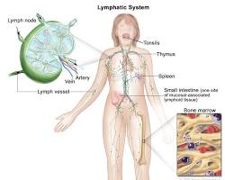
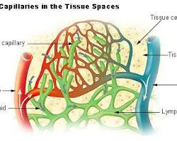
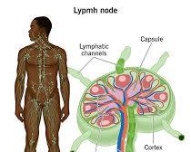
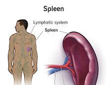
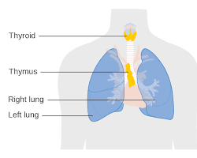
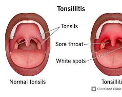

# Lymphs

The lymphatic system, also known as the lymph system, is a crucial component of the body's immune system. It's a network of vessels and nodes that transport 
a clear fluid called lymph throughout the body. The lymph is a clear fluid containing white blood cells. Lymph plays a vital role in:

- **Immune Defense**: Lymph transports white blood cells, particularly lymphocytes, to various parts of the body to fight infections and diseases.

- **Fluid Balance**: Lymph helps maintain fluid balance in the body by collecting excess fluid from tissues and returning it to the bloodstream.

- **Waste Removal**: Lymph carries waste products, such as dead cells and cellular debris, from tissues to lymph nodes for filtration and elimination.

## Components of the Lymphatic System

- **Lymph Vessels**: These are thin-walled tubes that carry lymph throughout the body. 

   
  
  [Source](https://nci-media.cancer.gov/pdq/media/images/661751.jpg)

  They are similar to blood vessels but have a less structured organization.
  Lymph vessels can be classified into:
  - **Lymph capillaries**: The smallest vessels, absorbing fluid from tissues.
  - **Lymphatic vessels**: Larger vessels that transport lymph to lymph nodes.
    - Lymph vessels are thinner and more numerous than veins.
    - They branch out extensively throughout your body, starting as microscopic capillaries in tissues and gradually converging into larger vessels.
    - Unlike arteries and veins, which form a closed loop, lymph vessels are an open system that ultimately drains into your bloodstream near your collarbones.
    - Lymph vessels contain valves that prevent lymph from flowing backward.
    
    

    [Source](https://www.buddiesforlife.co.za/wp-content/uploads/2018/08/lymph-capillaries-in-tissue-spaces.jpg)
  
  - **Lymphatic ducts**: The largest vessels that drain lymph into the bloodstream.

- **Lymph Nodes**: These are bean-shaped structures located throughout the body, particularly in clusters around the neck, armpits, groin, and abdomen. Lymph nodes act as filters, trapping and removing harmful substances and pathogens from the lymph.

  

- **Lymphatic Organs**: These include the spleen, thymus, and tonsils. Each organ plays a unique role in the immune system:

  - **Spleen**: Filters blood, removes damaged cells, and produces immune cells.
   
    
  
  - **Thymus**: Plays a critical role in the development of T cells, a type of white blood cell crucial for cell-mediated immunity.
  
    
  
  - **Tonsils**: Located at the back of the throat, they trap and fight off pathogens entering through the mouth and nose.
   
    

- **Lymph**: This is the clear fluid that flows through the lymph vessels and nodes. It contains water, electrolytes, proteins, and white blood cells. Lymph is constantly being filtered and cleaned as it passes through lymph nodes.

- **Cisterna Chyli**: This is a large lymph vessel located in the abdomen that collects lymph from the digestive system and lower body.

- **Thoracic Duct**: This is the main lymph vessel that carries lymph from the lower body and eventually empties into the bloodstream near the left subclavian vein.

## Functions of the Lymphatic System

The lymphatic system performs several essential functions:

- **Fluid Balance**: It maintains fluid balance in the body by collecting excess interstitial fluid (fluid between cells) and returning it to the bloodstream. This prevents swelling and helps regulate blood pressure.

- **Immune Defense**: The lymphatic system is a vital component of the immune system. It transports white blood cells, including lymphocytes (B cells and T cells), throughout the body to fight infections and diseases. Lymph nodes act as filters, trapping and destroying pathogens and abnormal cells.

- **Lipid Absorption**: The lymphatic system plays a role in absorbing fats (lipids) from the small intestine. These lipids are transported through the lymphatic vessels and eventually enter the bloodstream.

## How the Lymphatic System Works

- **Lymph Formation**: Lymph is formed when excess fluid from tissues leaks into the surrounding spaces. This fluid contains dissolved substances, proteins, and cells, including white blood cells.

- **Lymph Flow**: Lymph is then transported through a network of lymph vessels by the gentle contractions of nearby muscles and the pressure differences created by breathing.

- **Lymph Node Filtration**: As lymph flows through lymph nodes, it passes through specialized mesh-like structures called sinuses. These sinuses trap harmful substances, such as bacteria, viruses, and dead cells.

- **Lymph Node Immune Response**: White blood cells in the lymph nodes are activated by the trapped pathogens and initiate an immune response. They may engulf and destroy the pathogens or produce antibodies to neutralize them.  The lymphatic system is a critical component of the immune system. It filters lymph, removing harmful pathogens like bacteria, viruses, and cancer cells. White blood cells in lymph nodes neutralize and destroy these threats, preventing them from reaching the bloodstream and causing infection or disease.

- **Lymph Return to Bloodstream**: Filtered lymph eventually leaves the lymph nodes and re-enters the bloodstream through the thoracic duct. This completes the cycle. The lymphatic system helps maintain fluid balance in the body. It collects excess fluid from tissues and returns it to the bloodstream, preventing edema (swelling) and maintaining proper tissue hydration. The lymphatic system plays a role in transporting fats (lipids) from the digestive system to the bloodstream. These fats, absorbed in the small intestine, are packaged into chylomicrons, tiny droplets that enter the lymphatic system and eventually reach the bloodstream.

## Lymph fluid movement relies on a few key mechanisms

### Drainage
The lymph fluid doesn't drain into a single point like the circulatory system. Instead, it has two main drainage points on either side of the upper body where it empties back into the bloodstream:

- **Right lymphatic duct**: This duct collects lymph fluid from the right arm, head, and neck. It drains into the right subclavian vein near the collarbone.
- **Thoracic duct**: This is the larger of the two ducts and collects lymph fluid from the rest of the body, including the left arm, chest, abdomen, and legs. It also drains into the left subclavian vein near the collarbone.

Here's a breakdown of the drainage pathway for the lymph fluid:

- **Lymph capillaries**: Microscopic vessels in tissues collect excess fluid and cellular debris, forming lymph fluid.
- **Lymph vessels**: Lymph fluid flows through a network of progressively larger vessels throughout the body.
- **Lymph nodes**: Located at various points along the lymph vessels, these nodes act as filters, trapping pathogens and debris.
- **Right lymphatic duct and thoracic duct**: These two main collecting ducts receive lymph fluid from different regions of the body.
- **Subclavian veins**: The right lymphatic duct and thoracic duct drain the filtered lymph fluid into the subclavian veins on either side near the collarbone.
- **Bloodstream**: Once in the subclavian veins, the lymph fluid re-enters the bloodstream, completing the circulation loop.

### Movement
- **Muscle contractions**:  As skeletal muscles contract during movement, they squeeze the lymph vessels nearby. This squeezing action helps propel lymph fluid forward through the vessels. So, simply moving around throughout the day plays a significant role in lymph movement.

- **Breathing**: The rhythmic contractions of the diaphragm muscle during inhalation create a pressure change within the chest cavity. This pressure change helps draw lymph fluid upward from the abdomen and lower body.

- **Smooth muscle contractions**: The walls of lymph vessels themselves contain smooth muscle fibers that can contract and help push lymph fluid onward. These contractions are much weaker than those of the heart, but they contribute to the overall flow.

- **Pressure gradients**: Lymph fluid naturally flows from areas of higher pressure to areas of lower pressure. The pressure differences within the lymphatic system help direct lymph fluid movement towards the ultimate drainage points near the collarbones.

- **One-way valves**: Lymph vessels have valves that prevent backward flow of lymph fluid. These valves ensure that lymph fluid travels in the correct direction, away from tissues and towards the bloodstream.

## Maintaining a Healthy Lymphatic System

A well-functioning lymphatic system is crucial for maintaining overall health.  If lymph vessels become blocked or damaged, fluid can build up in tissues, leading to a condition called lymphedema. This can cause swelling, discomfort, and increased risk of infection.

- **Regular Exercise**: Physical activity promotes lymph flow and helps prevent stagnation, which can lead to swelling and immune system impairment.

- **Stay Hydrated**: Adequate water intake helps maintain fluid balance and supports the lymphatic system's function in removing excess fluid.

- **Healthy Diet**: A balanced diet rich in fruits, vegetables, and whole grains provides the nutrients needed for a healthy immune system and overall well-being.

- **Manage Stress**: Chronic stress can suppress the immune system and potentially impair lymphatic function. Practice stress-reduction techniques like yoga or meditation.

- **Avoid Smoking**: Smoking damages lymphatic vessels and weakens the immune system. Quitting smoking can significantly improve lymphatic health.

- **Maintain a Healthy Weight**: Excess weight can put additional strain on the lymphatic system. Aim for a healthy weight and body composition.

- **Massage**: Gentle massage can help stimulate lymphatic flow and encourage the drainage of excess fluid.

- **Dry Brushing**: Dry brushing your skin towards your heart can promote lymphatic drainage and improve circulation.

The lymphatic system is an essential part of the body's defense system. By following these tips and maintaining a healthy lifestyle, you can support the lymphatic system's function and keep your immune system strong.