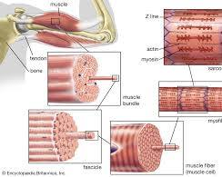
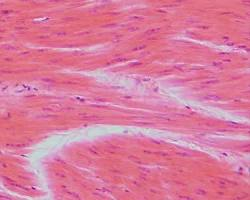

# Muscles

Muscles are the tissues in your body that allow you to move. They are attached to bones by tendons and contract to produce movement. There are three main types of muscles in the human body:

- Skeletal muscles: These are also called voluntary muscles because you consciously control them. They are attached to bones and are responsible for movements like walking, running, and lifting objects.

  

- Smooth muscles: These are involuntary muscles, meaning you don't consciously control them. They are found in the walls of organs like the stomach, intestines, and blood vessels. Smooth muscles are responsible for functions like digestion and blood flow.

  

- Cardiac muscle: This is the muscle that makes up your heart. It is an involuntary muscle that contracts rhythmically to pump blood throughout your body.
 
  

Skeletal muscles are made up of long, thin fibers that contain proteins called actin and myosin. When these proteins interact, the muscle fibers contract. The more muscle fibers that contract, the stronger the contraction.

Muscles are essential for many bodily functions, including:

- **Movement**: Muscles allow you to move your body in a variety of ways.
- **Posture**: Muscles help you maintain good posture.
- **Balance**: Muscles help you keep your balance.
- **Stability**: Muscles provide stability for your joints.
- **Organ function**: Smooth muscles help organs function properly.
- **Circulation**: Cardiac muscle pumps blood throughout your body.
- **Body temperature**: Muscle activity helps generate heat, which helps regulate your body temperature.

Here are some tips for keeping your muscles healthy:

- **Exercise regularly**: Regular exercise helps to strengthen your muscles and improve your overall fitness.
- **Eat a healthy diet**: A healthy diet that includes plenty of protein is important for muscle growth and repair.
- **Get enough sleep**: Sleep is important for muscle recovery.
- **Stretch regularly**: Stretching helps to improve muscle flexibility and range of motion.