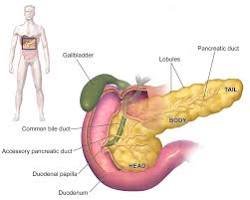

# Pancreas

The pancreas is a gland located behind your stomach in the upper left part of your abdomen. It plays a dual role in your body, functioning in both the digestive system and the endocrine system. Here's a closer look at the pancreas:

# Structure

The pancreas is a long, flat gland with two main parts:

- **Exocrine pancreas**: This larger portion of the pancreas produces digestive enzymes. These enzymes are released into the small intestine through a duct and help break down carbohydrates, proteins, and fats in your food.
- **Endocrine pancreas**: This cluster of cells, called islets of Langerhans, produces hormones that regulate blood sugar levels. The two main hormones produced are insulin and glucagon.

# Function

- **Digestion**: The exocrine pancreas releases a juice containing various digestive enzymes:
- **Amylase**: Breaks down carbohydrates into sugars.
- **Trypsin and chymotrypsin**: Break down proteins into amino acids.
- **Lipase**: Breaks down fats into fatty acids and glycerol.

These enzymes help ensure proper digestion and nutrient absorption in the small intestine.

- **Blood Sugar Regulation**: The endocrine pancreas produces hormones crucial for blood sugar control:
  - **Insulin**: Lowers blood sugar levels by signaling cells to absorb glucose from the bloodstream and store it as glycogen in the liver and muscles.
  - **Glucagon**: Raises blood sugar levels by stimulating the liver to convert glycogen back into glucose and releasing it into the bloodstream.

By regulating blood sugar levels, the pancreas ensures your body has the energy it needs for various functions.

# Interesting Facts

The pancreas is a relatively small organ, only about 6 inches long, but it plays a vital role in digestion and blood sugar control.
Sometimes the pancreas can become inflamed, leading to a condition called pancreatitis. This can cause severe pain and requires medical attention.
Diabetes mellitus is a chronic condition that results from problems with insulin production or function.

# Maintaining a Healthy Pancreas

- **Eat a healthy diet**: Limit processed foods, sugary drinks, and unhealthy fats. Choose a diet rich in fruits, vegetables, and whole grains, which can help regulate blood sugar levels and reduce stress on the pancreas.
- **Maintain a healthy weight**: Obesity is a risk factor for type 2 diabetes, which can affect the pancreas.
- **Don't smoke**: Smoking can damage the pancreas and increase the risk of pancreatitis.
- **Limit alcohol consumption**: Excessive alcohol consumption can also stress the pancreas.
- **Exercise regularly**: Regular physical activity can improve insulin sensitivity and reduce the risk of type 2 diabetes.