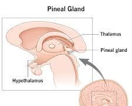

# Pineal gland

The pineal gland, also sometimes referred to as the pineal body or epiphysis cerebri, is a small pinecone-shaped gland located deep inside the brain. It's a fascinating structure shrouded in a bit of mystery, but we do know it plays a crucial role in regulating sleep and wakefulness cycles. Here's a deeper look at the pineal gland and its functions:

# Structure

The pineal gland is a tiny gland, about the size of a pea, situated near the center of the brain. It consists of pinealocytes, specialized cells that produce hormones.

# Function

The pineal gland's primary function is to produce melatonin, a hormone involved in regulating circadian rhythms, your body's internal clock. Melatonin production is heavily influenced by light exposure:

- **Darkness**: Darkness stimulates the pineal gland to produce melatonin. Melatonin levels rise in the evening, signaling to the body that it's time to prepare for sleep.
- **Light**: Exposure to light, particularly sunlight, suppresses melatonin production. Melatonin levels naturally decrease in the morning, promoting wakefulness.

# Importance of Melatonin

Melatonin plays a key role in regulating sleep-wake cycles:

- **Sleep initiation and maintenance**: Melatonin helps initiate sleep by promoting drowsiness and regulating sleep patterns.
- **Sleep quality**: Melatonin may contribute to deeper, more restorative sleep.
- **Regulation of alertness**: Melatonin levels influence feelings of alertness and wakefulness throughout the day-night cycle.

# Melatonin and Beyond

While melatonin regulation is the pineal gland's primary known function, some research suggests it may have other roles:

- **Seasonal Affective Disorder (SAD)**: Melatonin levels may be involved in SAD, a type of depression that occurs seasonally.
- **Sexual development**: The pineal gland may play a role in regulating sexual development and function, although the exact mechanisms are not fully understood.
- **Aging**: Some studies suggest melatonin production may decline with age, potentially contributing to sleep disturbances in older adults.

# Maintaining a Healthy Pineal Gland

While there's no direct way to target the pineal gland itself, here are some lifestyle practices that can promote healthy sleep patterns and potentially influence melatonin production indirectly:

- **Maintain a regular sleep schedule**: Go to bed and wake up at consistent times each day, even on weekends.
- **Create a relaxing bedtime routine**: Wind down before bed with calming activities like reading or taking a warm bath.
- **Optimize your sleep environment**: Ensure your bedroom is dark, quiet, cool, and clutter-free to promote better sleep.
- **Limit screen time before bed**: The blue light emitted from electronic devices can suppress melatonin production.
- **Get regular exercise**: Engage in regular physical activity, but avoid vigorous exercise close to bedtime.
- **Manage stress**: Chronic stress can disrupt sleep patterns. Practice relaxation techniques to manage stress effectively.

**If you experience persistent sleep problems, consult your doctor to rule out any underlying medical conditions and discuss treatment options.**

**The pineal gland remains an intriguing area of research, and scientists are still unraveling its full potential. However, its role in regulating sleep through melatonin production is well-established.**