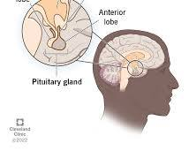

# Pituitary gland

The pituitary gland, also sometimes referred to as the hypophysis, is often called the "master gland" of the endocrine system.  Located at the base of your brain, this pea-sized gland plays a critical role in regulating many vital bodily functions by producing and releasing hormones that target other glands throughout the body. Here's a closer look at the pituitary gland, its hormones, and its functions:

# Structure

The pituitary gland is divided into two main lobes:

- **Anterior pituitary**: This larger, front lobe produces several hormones that control various functions, including growth, reproduction, metabolism, and stress response.
- **Posterior pituitary**: This smaller, rear lobe doesn't technically produce hormones itself. Instead, it stores and releases hormones produced by the hypothalamus, a region of the brain located just above the pituitary gland.

# Hormones

The anterior pituitary gland produces a variety of hormones, each with a specific target and function:

- **Growth hormone (GH)**: Stimulates growth and development of bones, muscles, and organs.
- **Thyroid-stimulating hormone (TSH)**: Signals the thyroid gland to produce thyroid hormones, which regulate metabolism and other functions.
- **Adrenocorticotropic hormone (ACTH)**: Stimulates the adrenal glands to release cortisol, a hormone involved in stress response, metabolism, and immune function.
- **Follicle-stimulating hormone (FSH) and Luteinizing hormone (LH)**: Play a crucial role in regulating the menstrual cycle and ovulation in females and sperm production in males.
- **Prolactin**: Stimulates milk production in women after childbirth.

# Functions

The hormones produced by the pituitary gland act as chemical messengers, influencing a wide range of bodily functions:

- **Growth and development**: Growth hormone is essential for normal childhood growth and development.
- **Metabolism**: Pituitary hormones regulate metabolism by influencing thyroid hormone production and other factors.
- **Reproduction**: FSH, LH, and prolactin are essential for regulating the menstrual cycle, ovulation, sperm production, and milk production.
- **Stress response**: ACTH stimulates the release of cortisol, which helps the body cope with stress.
- **Fluid balance**: The posterior pituitary gland releases hormones that regulate blood pressure and water balance.

# Conditions

Several conditions can affect the pituitary gland:

- **Pituitary tumors**: These can be benign (noncancerous) or malignant (cancerous) and can disrupt hormone production.
- **Pituitary adenomas**: These are benign tumors of the pituitary gland that can cause hormone imbalances.
- **Pituitary insufficiency**: This occurs when the pituitary gland doesn't produce enough of one or more hormones.
- **Sheehan's syndrome**: A rare condition that damages the pituitary gland due to severe blood loss during childbirth.

# Importance of a Healthy Pituitary Gland

A healthy pituitary gland is crucial for maintaining overall well-being.  If you experience symptoms that might suggest a pituitary problem, such as growth abnormalities, menstrual irregularities, or vision problems, consult your doctor for proper diagnosis and treatment.

Here are some general tips for promoting overall health:

- **Maintain a balanced diet**: Eat a healthy diet rich in fruits, vegetables, and whole grains to provide your body with the nutrients it needs to function optimally.
- **Maintain a healthy weight**: Obesity can disrupt hormone production and function.
- **Manage stress**: Chronic stress can affect hormone regulation. Practice relaxation techniques to manage stress effectively.
- **Get regular checkups**: Regular checkups with your doctor can help monitor hormone levels and detect any potential pituitary problems early on.
