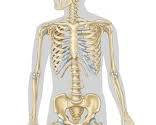

# Skeleton

The skeleton is the internal framework of the human body. It provides support, structure, and protection to the body's organs. It also allows the body to move. The skeleton is made up of about 206 bones in adults. These bones are connected to each other by ligaments, tendons, and cartilage.

The skeleton can be divided into two main parts: the axial skeleton and the appendicular skeleton.

- The axial skeleton is the central part of the skeleton. It includes the skull, the vertebral column, the ribs, and the sternum.
- The appendicular skeleton includes the bones of the limbs (arms and legs) and the shoulder girdle and pelvic girdle.

The functions of the skeleton include:

- **Support**: The skeleton provides support for the body's soft tissues and organs.
- **Movement**: The bones of the skeleton work together with the muscles to allow the body to move.
- **Protection**: The skeleton protects the body's vital organs from injury.
- **Production of blood cells**: The red bone marrow in some bones of the skeleton is responsible for producing red blood cells, white blood cells, and platelets.
- **Storage of minerals**: The bones store minerals, such as calcium and phosphorus, which are important for the body's health.
- **Endocrine regulation**: The bones also produce hormones that help to regulate blood calcium levels.

The skeleton is constantly changing throughout life. In childhood, the bones grow and develop. In adulthood, the bones reach their full size and density. As people age, the bones may become less dense and more fragile. This can increase the risk of fractures.

There are many conditions that can affect the skeleton. Some of the most common conditions include:

- **Osteoporosis**: This is a condition that causes bones to become weak and brittle.
- **Arthritis**: This is a condition that causes inflammation of the joints.
- **Fractures**: These are breaks in bones.
- **Cancer**: Cancer can affect any part of the body, including the bones.