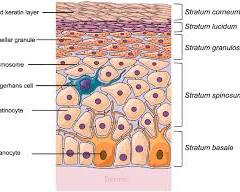
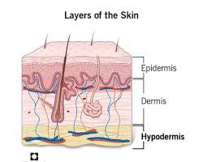

# Skin

The skin is the largest organ of your body, accounting for about 15% of your total body weight. It acts as a protective barrier shielding you from the external environment, including harmful substances, pathogens, and even sunlight.  Here's a breakdown of the skin's structure and its vital functions:

## Structure

The skin is a complex organ with multiple layers, each with specific functions:

- **Epidermis (Outermost layer)**: This thin, tough layer is made up of dead, flattened cells called keratinocytes. The epidermis is the waterproof layer that helps keep water in and harmful substances out.

- **Dermis (Middle layer)**: The dermis is the thickest layer of the skin, composed of connective tissue, blood vessels, hair follicles, sweat glands, and sebaceous glands. It provides strength, elasticity, and nourishment to the skin.

- **Hypodermis (Innermost layer)**: Also known as the subcutaneous layer, the hypodermis is made up of fat and connective tissue. It insulates the body, stores energy, and cushions organs.

## Functions

The skin plays a vital role in your overall health and well-being by performing several important functions:

- **Protection**: The skin shields you from harmful substances like bacteria, viruses, and pollutants. It also protects you from UV radiation from the sun.
- **Temperature regulation**: The skin helps regulate body temperature through sweating and blood vessel constriction and dilation.
- **Sensation**: The skin is packed with nerve endings that allow you to feel sensations like touch, pain, pressure, and temperature.
- **Vitamin D production**: The skin can synthesize vitamin D when exposed to sunlight, which is essential for bone health and other bodily functions.
- **Fluid balance**: The skin plays a role in regulating fluid balance by preventing excessive water loss through sweating.
- **Nonverbal communication**: Your skin plays a role in nonverbal communication, such as blushing or sweating, which can convey emotions.

## Interesting Facts 

- The skin is constantly regenerating itself. The outer layer of skin, the epidermis, sheds dead skin cells and replaces them with new ones every 28-30 days.
- The surface area of the skin on an adult human is about 22 square feet (2 square meters).
- Fingerprints are unique patterns of ridges and valleys on the fingertips and palms that begin to form before birth.

## Maintaining Healthy Skin

Here are some tips for keeping your skin healthy:

- **Practice good hygiene**: Wash your skin regularly with a gentle cleanser and lukewarm water.
- **Moisturize**: Use a moisturizer to keep your skin hydrated, especially after showering or bathing.
- **Protect yourself from the sun**: Limit sun exposure, especially during peak hours, and wear sunscreen with SPF 30 or higher daily.
- **Eat a healthy diet**: A balanced diet rich in fruits, vegetables, and whole grains can nourish your skin from the inside out.
- **Drink plenty of water**: Staying hydrated helps keep your skin plump and healthy.
- **Manage stress**: Chronic stress can take a toll on your skin health. Relaxation techniques like yoga or meditation can help.
- **Don't smoke**: Smoking damages the skin and accelerates aging.