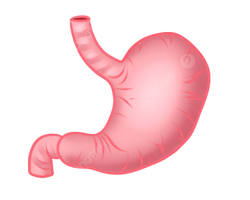

# Stomach

The stomach is a muscular, J-shaped organ that sits in the upper left part of your abdomen, just between your esophagus and small intestine. It plays a vital role in the digestive system by acting as a temporary storage and breakdown chamber for food. Here's a closer look at the stomach's structure and function:

## Structure

The stomach has four main regions:

- **Fundus**: The upper rounded area that curves upward.
- **Body**: The main, central part of the stomach where most food storage and initial breakdown occur.
- **Antrum**: The lower, funnel-shaped region that mixes and churns food before releasing it into the small intestine.
- **Pylorus**: The narrow, muscular valve at the exit of the stomach that controls the flow of partially digested food (chyme) into the small intestine.

The inner lining of the stomach is protected by a thick layer of mucus, which helps shield it from the acidic digestive juices produced by the stomach itself.

## Function

The stomach's primary function is to store and break down food into a liquid mixture called chyme. Here's how it accomplishes this:

- **Storage**: The stomach acts as a temporary holding tank for food, allowing you to eat relatively large amounts at a time without overwhelming the digestive system. Muscles in the stomach wall relax and contract to store and churn the food.
- **Mechanical Breakdown**: As the muscles contract and relax, they physically break down food particles into smaller pieces, increasing the surface area for enzyme action.
- **Chemical Breakdown**: The stomach releases gastric juices, a potent cocktail containing:
  - **Hydrochloric acid**: This strong acid breaks down complex proteins and creates an environment suitable for enzyme activity.
  - **Pepsin**: This enzyme breaks down proteins into smaller peptides.
  - **Gastric lipase**: This enzyme begins the breakdown of fats.

Once food is sufficiently broken down into chyme, the pylorus valve opens, allowing it to pass slowly into the small intestine for further digestion and nutrient absorption.

## Interesting Facts

- The stomach can hold up to about 4 cups (1 liter) of food and liquid at a time.
- The muscular contractions of the stomach wall are called peristalsis. These waves of muscle movement help churn and mix food with digestive juices.
- The stomach lining is constantly regenerating itself to replace cells damaged by the strong digestive acids.

## Maintaining a Healthy Stomach

Here are some tips for keeping your stomach healthy:

- **Eat a balanced diet**: Choose a diet rich in fruits, vegetables, and whole grains. Limit processed foods, sugary drinks, and excessive fatty or spicy foods, which can irritate the stomach lining.
- **Eat smaller meals more frequently**: This can help prevent overeating and stomach discomfort.
- **Chew your food thoroughly**: This aids in digestion by breaking down food particles mechanically before they reach the stomach.
- **Manage stress**: Chronic stress can contribute to digestive problems like stomach ulcers. Practice relaxation techniques to manage stress levels.
- **Don't smoke**: Smoking can irritate the stomach lining and increase the risk of ulcers.
- **Limit alcohol consumption**: Excessive alcohol consumption can damage the stomach lining and contribute to stomach ulcers.