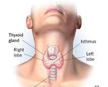

# Thyroid gland

The thyroid gland is a small, butterfly-shaped gland located at the front of your neck, just below your Adam's apple.  Despite its size, it plays a crucial role in your body by producing hormones that regulate many vital functions. Here's a breakdown of the thyroid gland, its hormones, and its functions:

# Structure

The thyroid gland is made up of two lobes connected by a thin band of tissue called the isthmus.  Thyroid follicles are tiny structures within the gland that produce thyroid hormones.  These follicles store a protein complex called thyroglobulin, which contains the building blocks for the hormones.

# Hormones

The thyroid gland produces two main hormones:

- **Triiodothyronine (T3)**: This is the most active form of thyroid hormone. It influences various bodily functions, including metabolism, heart rate, and body temperature.
- **Thyroxine (T4)**: This is a less active form of thyroid hormone that can be converted to T3 in the body's tissues as needed.

# Functions

Thyroid hormones act like chemical messengers, influencing almost every cell in your body. Here are some of their key functions:

- **Metabolism**: Thyroid hormones regulate the rate at which your body uses energy (basal metabolic rate). They influence how quickly calories are burned and how efficiently cells convert oxygen and glucose into energy.
- **Growth and Development**: Thyroid hormones are essential for normal growth and development, particularly in children. They play a role in bone growth, brain development, and nervous system function.
- **Heart Rate and Blood Pressure**: Thyroid hormones influence heart rate and blood pressure.
- **Body Temperature**: They help regulate your body temperature by influencing heat production and dissipation.
- **Muscle and Fat Control**: Thyroid hormones affect muscle strength and function, as well as fat storage and breakdown.
- **Brain Function**: These hormones are crucial for cognitive function, memory, and mood regulation.

# Conditions

There are two main thyroid conditions:

- **Hyperthyroidism**: This occurs when the thyroid gland produces too much thyroid hormone. Symptoms can include weight loss, rapid heartbeat, anxiety, tremors, and difficulty sleeping.
- **Hypothyroidism**: This occurs when the thyroid gland doesn't produce enough thyroid hormone. Symptoms can include fatigue, weight gain, feeling cold, constipation, and dry skin.

# Importance of a Healthy Thyroid

A healthy thyroid gland is vital for overall well-being.  If you experience any symptoms that might suggest a thyroid problem, it's important to consult your doctor for proper diagnosis and treatment.

Here are some additional points to consider:

- **Iodine**: Iodine is a mineral essential for thyroid hormone production. Most people get enough iodine from table salt iodized with potassium iodide.
- **Thyroid Function Tests**: A simple blood test can measure thyroid hormone levels to assess thyroid function.
- **Treatment**: Depending on the condition, treatment for thyroid disorders may involve medication, radioactive iodine therapy, or surgery.